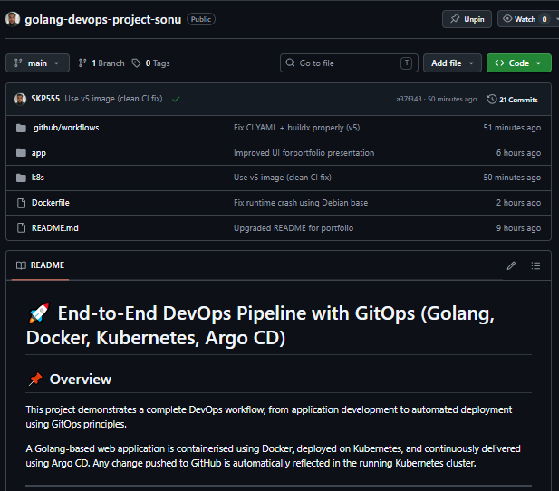
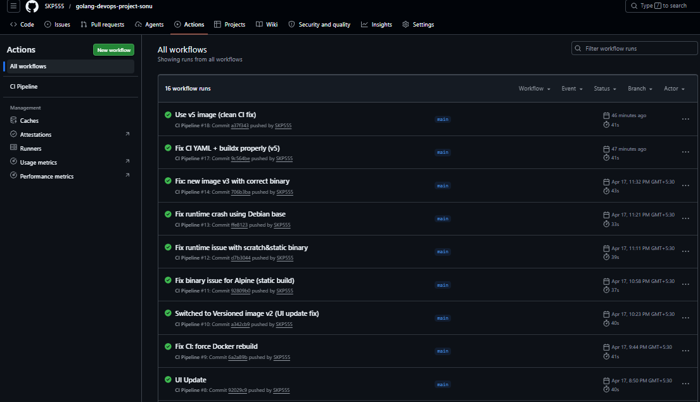
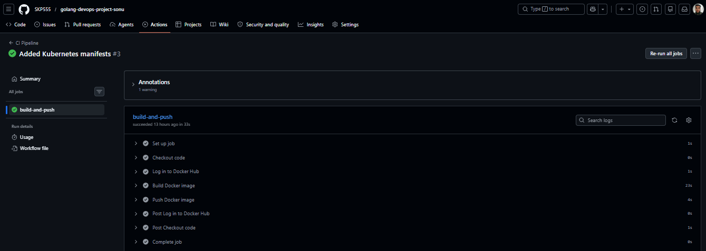
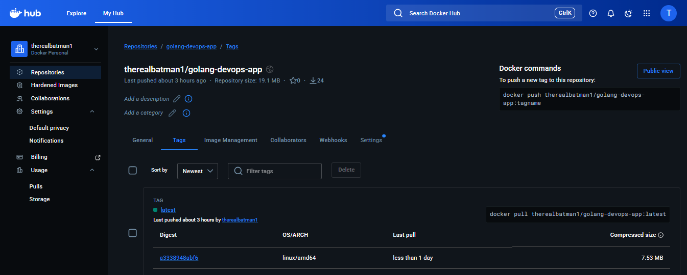
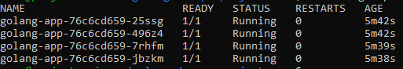
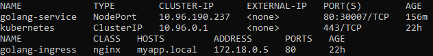
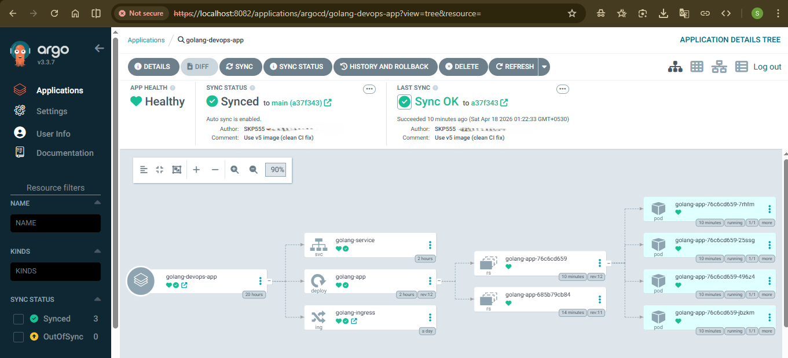
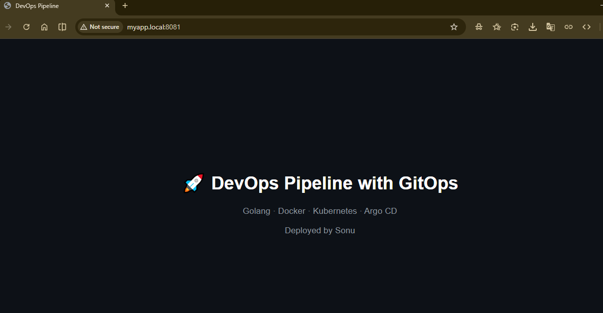

# 🚀 End-to-End DevOps Pipeline with GitOps

**Golang · Docker · Kubernetes · Argo CD · GitHub Actions**

> Fully automated CI/CD pipeline with GitOps-based deployment and self-healing Kubernetes infrastructure.

---

## 📌 Overview

This project implements a complete DevOps pipeline where a Golang web application is containerised, deployed on Kubernetes, and continuously delivered using GitOps principles.

Any code change pushed to GitHub automatically triggers a CI pipeline, builds a Docker image, and updates the live Kubernetes application via Argo CD.

---

## 🧠 Architecture
GitHub → GitHub Actions → Docker Hub → Argo CD → Kubernetes → Live Application

- GitHub Actions builds and pushes Docker images 
- Docker Hub stores versioned container images 
- Kubernetes manages deployment, scaling, and networking 
- Argo CD continuously syncs cluster state with Git 
- Ingress exposes the application externally 

---

## ⚙️ Tech Stack

- Golang 
- Docker (multi-stage builds) 
- Kubernetes (Deployment, Service, Ingress) 
- GitHub Actions (CI pipeline) 
- Argo CD (GitOps CD) 
- NGINX Ingress Controller 

---

## 🔄 CI/CD Workflow

1. Code is pushed to GitHub 
2. GitHub Actions builds Docker image 
3. Image is pushed to Docker Hub 
4. Argo CD detects repository changes 
5. Kubernetes cluster updates automatically 

👉 Fully automated deployment with no manual intervention

---

## 🚀 Key Features

- End-to-end CI/CD pipeline with GitHub Actions 
- Containerised Golang application using Docker 
- Kubernetes-based scalable deployment (replicas + self-healing) 
- Service and Ingress-based traffic routing 
- GitOps workflow with Argo CD (auto-sync + reconciliation) 
- Zero manual deployment workflow 

---
```text
## 📁 Project Structure

golang-devops-project-sonu/
├── app/ # Golang application
├── k8s/ # Kubernetes manifests
├── .github/workflows/ # CI pipeline
├── images/ # Project screenshots
├── Dockerfile
└── README.md
```
---

# 📸 Project Demonstration

---

## 🔹 Source Repository



Source code and project structure for the DevOps pipeline.

---

## 🔹 CI/CD Pipeline



Automated CI pipeline triggered on every push.

### 🔍 Detailed Execution



Build and push stages using Docker Buildx.

---

## 🔹 Docker Image



Versioned container image used for deployment.

---

## 🔹 Kubernetes Deployment



Pods running successfully with replication and self-healing.

---

## 🔹 Service & Ingress



Application exposed via Ingress using custom host.

---

## 🔹 GitOps (Argo CD)



- Application state: **Healthy** 
- Sync status: **Synced** 

Automated GitOps deployment pipeline.

---

## 🔹 Application UI



Final deployed application accessible via browser.

---

## 🔧 Challenges & Solutions

Faced several real-world DevOps issues during implementation:

- Container runtime failure due to binary incompatibility 
- Kubernetes CrashLoopBackOff debugging 
- CI pipeline failure due to YAML syntax errors 
- Image pull errors (ErrImagePull) 

### Resolutions:

- Fixed build process and runtime compatibility 
- Debugged Kubernetes logs and rollout behaviour 
- Corrected CI workflow configuration 
- Implemented Docker Buildx for cross-platform builds 

---

## 🧠 Key Learnings

- Designed and implemented a complete DevOps pipeline 
- Gained hands-on experience with GitOps workflows 
- Improved debugging skills in Kubernetes environments 
- Understood real-world CI/CD pipeline failures and fixes 

---

## 🎯 Future Improvements

- Helm-based deployment 
- Cloud deployment (AWS / GCP) 
- Monitoring (Prometheus, Grafana) 
- Multi-environment setup 

---

## 👤 Author

**Sonu Krishna** 
```text
DevOps | Cloud | Kubernetes 

- GitHub: https://github.com/SKP555 
- LinkedIn: https://www.linkedin.com/in/sonukrsna 
```
